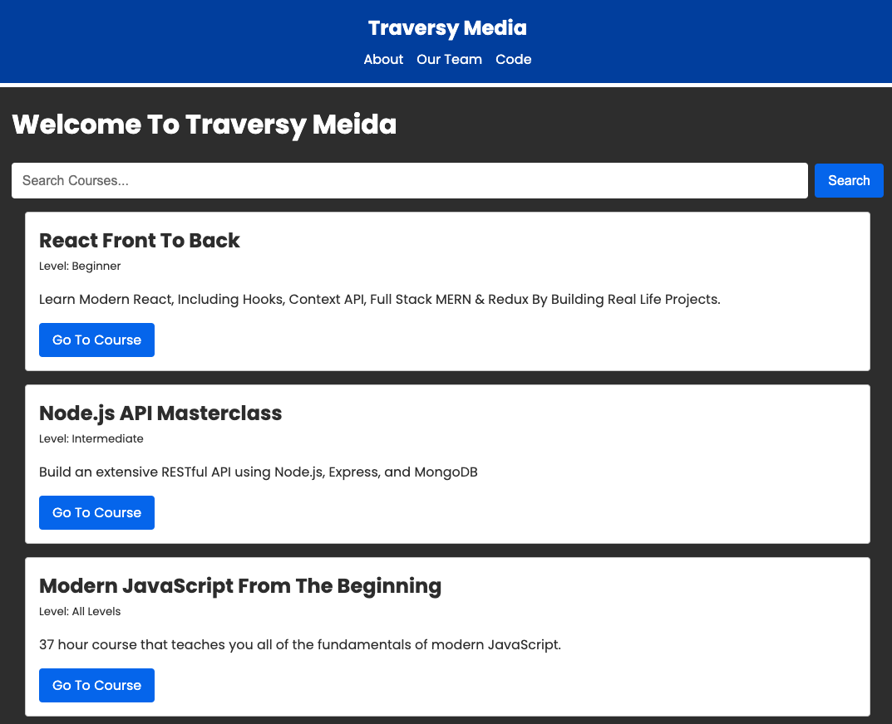

# Next.js 13 Crash Course Project

This is a project from my [Next.js 13 Crash Course](https://youtu.be/Y6KDk5iyrYE). It uses the newer features such as:

- App directory
- New routing system
- Next Fonts
- React Server Components
- Data Fetching
- Layouts
- Metadata API
- API Route Handlers
- loading.js Page
- and more



## Usage

Install dependencies:

```bash
npm install
# or
yarn
```

Run the development server:

```bash
npm run dev
# or
yarn dev
```

Open [http://localhost:3000](http://localhost:3000) with your browser to see the result.

Build the project:

```bash
npm run build
# or
yarn build
```

Run production build:

```bash
npm run start
# or
yarn start
```
